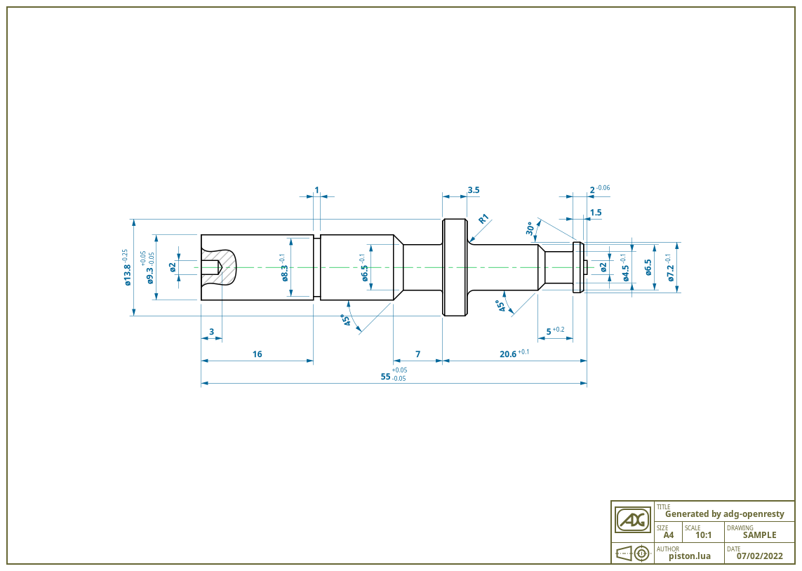
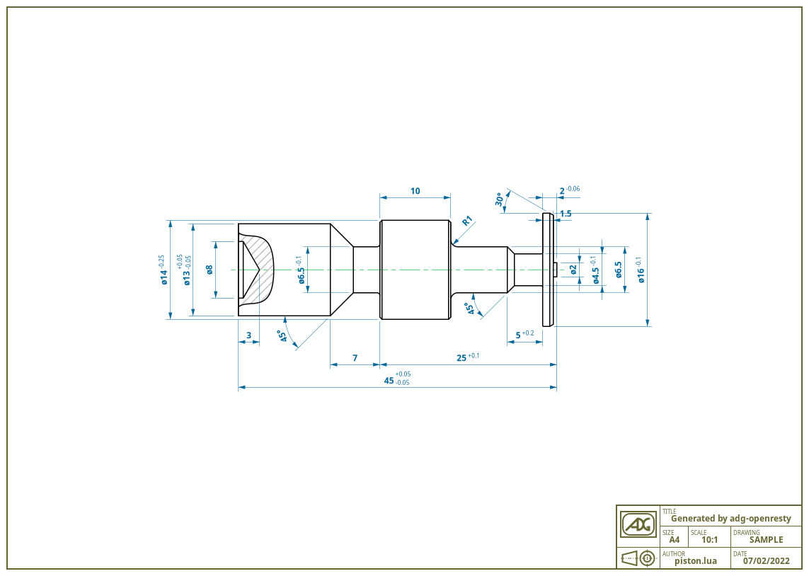

General information
===================

This is an example of [ADG](https://adg.entidi.com) usage scenario: an
end-point for generating dynamic drawings solely based on the OpenResty
webserver.

[OpenResty](https://openresty.org/) is an NGINX webserver flavour with
integrated Lua support for stellar performances. This makes it a perfect
fit for automatic drawing generation.


Installation
============

You should already have OpenResty installed somewhere in your system.
Also, you must have at least installed the runtime and development
packages of the following projects:

* cairo
* pango
* gobject-introspection

On desktop system, these dependencies are usually already installed but
on headless servers some manual intervention is likely needed. Here are
the steps needed on a typical Debian 9 server:

```sh
# Install the required dependencies on Debian 9
apt install build-essential \
            gobject-introspection libgirepository1.0-dev \
            libcairo2-dev libpango1.0-dev
# For more recent releases, we install ninja and meson with `pip3`
apt install python3-pip
pip3 install meson ninja
```

On other systems, something similar would likely be required. Once every
needed dependency is installed, we can build everything else inside a
local folder: no root privileges are needed here!

```sh
mkdir my-adg-app
cd my-adg-app
git clone https://github.com/pavouk/lgi/
git clone https://github.com/ntd/adg
git clone https://github.com/ntd/adg-openresty
cd adg-openresty
# Customize the environment to match your system
vi helpers/env.conf
helpers/build-lgi ../lgi
helpers/build-adg ../adg
```

Once everything has been built, you can start or stop the adg-openresty
service by using the helper script `adg-openresty`:

```sh
# To start the service
helpers/adg-openresty start
# To stop the service
helpers/adg-openresty stop
```

Once the service is successfully started, you can see the results on
`http://localhost:2784/piston.png`. The default piston should be
something similar to the following drawing:



You can change any variable by passing custom settings as GET arguments.
The list of possible variable names, together with their fallback
values, is exposed in [piston.lua](./app/piston.lua), function `DATA()`.
For example, you should get the following piston with
`http://localhost:2784/piston.png?A=45&B=25&DHOLE=8&DGROOVE=&D1=13&D3=14&LD3=10&D6=16`:



License
=======

This project is licensed under the terms of the [MIT license](./LICENSE).
